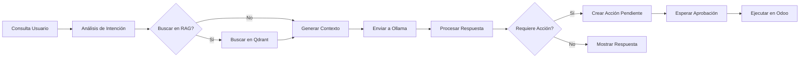

# 🚀 AI Production Assistant - Sistema de Inteligencia Operativa Empresarial


**Sistema revolucionario de inteligencia operativa basado en Mixture of Experts (MoE) y principios Kaizen**  
*Privacidad total · Procesamiento local · Automatización proactiva · Integración completa*

---

## 🎯 Visión Transformadora

No es solo un "asistente de chat" - es un **Sistema de Inteligencia Operativa Empresarial** que:

- 🧠 **Actúa como MoE (Mixture of Experts)**: Expertos especializados por área de negocio
- 📈 **Aplica principios Kaizen**: Mejora continua integrada en el ADN del sistema  
- 🔔 **Es proactivo**: Alertas automáticas sin que el usuario pregunte
- 🌐 **Integra todos los procesos**: Manufactura, Ventas, Inventario, Compras, Proyectos, Contabilidad
- 🚨 **Funciona como watchdog**: Monitorea y alerta sobre riesgos operativos

## 📋 Índice

- [🎯 Visión Transformadora](#-visión-transformadora)
- [🚀 Características Revolucionarias](#-características-revolucionarias)
- [🏗️ Arquitectura MoE Kaizen](#️-arquitectura-moe-kaizen)
- [🛠️ Requisitos del Sistema](#️-requisitos-del-sistema)
- [📦 Instalación](#-instalación)
- [⚙️ Configuración](#️-configuración)
- [🤖 Uso del Sistema](#-uso-del-sistema)
- [🔧 Estructura del Proyecto](#-estructura-del-proyecto)
- [📊 Dashboard y Vistas](#-dashboard-y-vistas)
- [⚠️ Solución de Problemas](#️-solución-de-problemas)
- [📈 Roadmap](#-roadmap)
- [📄 Licencia](#-licencia)
- [👨‍💻 Equipo](#-equipo)

---

## 🚀 Características Revolucionarias

### 🧠 **Arquitectura MoE (Mixture of Experts)**

- **Expertos especializados** por módulo de Odoo:
  - 🏭 **ManufacturingExpert**: Órdenes de producción, planificación, retrasos
  - 📊 **SalesExpert**: Oportunidades, cotizaciones, pipeline de ventas  
  - 📦 **InventoryExpert**: Stock, alertas de rotura, ajustes
  - 💰 **AccountingExpert**: Flujo de caja, análisis financiero
  - 🎯 **ProjectExpert**: Tareas, reuniones, seguimiento de proyectos
  - 🔧 **MaintenanceExpert**: Mantenimiento preventivo, alertas de equipo

### 📈 **Sistema Proactivo Kaizen**

- **Alertas automáticas**: "Necesitamos producir X, validar acción pendiente"
- **Detección de riesgos**: "Proyecto Y se retrasará si no hacemos Z"
- **Prevención de problemas**: "Stock de W en peligro de rotura, aprobar compra?"
- **Mejora continua**: Aprendizaje automático de patrones operativos

### 🔄 **Arquitectura Agentic HABA Avanzada**

- **Hybrid Agentic Behavior Architecture** que permite a la IA:
  - 🤔 **Pensar**: Analizar situaciones complejas multisistema
  - 🛠️ **Actuar**: Ejecutar acciones en múltiples módulos simultáneamente
  - 👥 **Colaborar**: Coordinar entre expertos para soluciones integrales
  - 📊 **Decidir**: Tomar decisiones basadas en datos en tiempo real

### 🧠 **Optimización para Modelos Locales**

- **ChatML Format** para máxima compatibilidad con modelos locales
- **Context window optimizado** para modelos pequeños pero poderosos
- **RAG avanzado** con memoria a largo plazo y búsqueda semántica

### 📊 **RAG Multicontexto Avanzado**

- **Extracción inteligente de datos** de cualquier modelo de Odoo
- **Inclusión de campos relacionales** en el contexto
- **Vectorización semántica** con Qdrant para búsqueda precisa
- **Filtros dinámicos** por usuario, empresa, fechas

### ⚡ **Rendimiento y Robustez**

- **Timeouts extendidos** (600s) para procesamiento de LLMs locales
- **Reintentos automáticos** y manejo de errores
- **Procesamiento en cola** para no bloquear la interfaz
- **Cache de respuestas** para preguntas frecuentes

### 🔒 **Privacidad y Seguridad**

- **Procesamiento 100% local** a través de Ollama
- **Sin envío de datos a servidores externos**
- **Control granular de permisos** por usuario y grupo
- **Auditoría completa** de todas las interacciones

---

## 🛠️ Requisitos del Sistema

### 📋 Requisitos Mínimos

| Componente  | Versión | Notas                         |
|------------ |---------|-------------------------------|
| **Odoo**    | 19.0    | Community o Enterprise        |
| **Python**  | 3.13+   | 3.13.0 o superior             |
| **Ollama**  | 0.5.0+  | Servicio corriendo localmente |
| **RAM**     | 8 GB    | Mínimo para modelos pequeños  |
| **Storage** | 10 GB   | Para modelos y vector DB      |

### 🔧 Dependencias Python

```bash
# Instaladas automáticamente por Odoo
- requests>=2.31.0
- qdrant-client>=1.6.0
- sentence-transformers>=2.2.2
- langchain>=0.1.0
```

### 🐳 Opcional: Docker Compose

```yaml
version: '3.8'
services:
  ollama:
    image: ollama/ollama:latest
    ports:
      - "11434:11434"
    volumes:
      - ollama_data:/root/.ollama
    restart: unless-stopped
  
  qdrant:
    image: qdrant/qdrant:latest
    ports:
      - "6333:6333"
    volumes:
      - qdrant_data:/qdrant/storage
    restart: unless-stopped
```

---

## 📦 Instalación

### 1. 🔄 Configuración de Ollama

```bash
# Instalar Ollama
curl -fsSL https://ollama.ai/install.sh | sh

# Iniciar servicio
sudo systemctl start ollama

# Descargar modelo recomendado
ollama pull gemma3:4b
# o
ollama pull llama3.2:3b
```

### 2. 🛠️ Configuración de Odoo

```ini
# En tu odoo.conf
[options]
addons_path = /path/to/odoo/addons,/path/to/custom_addons
limit_time_real = 600
limit_time_cpu = 600
workers = 4
max_cron_threads = 2
```

### 3. 📁 Instalación del Módulo

```bash
# Clonar o copiar el módulo
cd /path/to/odoo/custom_addons
git clone [tu-repositorio] ai_production_assistant

# Actualizar lista de módulos
python odoo-bin -c odoo.conf --update ai_production_assistant

# Instalar
python odoo-bin -c odoo.conf -i ai_production_assistant
```

### 4. ✅ Verificación

```bash
# Verificar logs de instalación
tail -f /var/log/odoo/odoo.log | grep ai_production_assistant
```

---

## ⚙️ Configuración

### 1. 🏢 Configuración Inicial

1. Navegar a **Fabricación → Asistente IA**
2. Ir a **Configuración → Modelos IA**
3. Sincronizar modelos disponibles de Ollama
4. Configurar modelos por defecto

### 2. 🔗 Configuración de Ollama

```yaml
# Ejemplo de configuración
URL: http://localhost:11434
Modelo por defecto: tinyllama
Temperatura: 0.7
Max Tokens: 2000
Timeout: 600
```

### 3. 🗃️ Configuración de Qdrant (Opcional)

```yaml
Servidor: localhost:6333
Colección: odoo_documents
Embedding Model: all-MiniLM-L6-v2
Dimensiones: 384
```

### 4. 👥 Configuración de Permisos

```bash
# Recomendaciones:
- Usuarios normales: Lectura y creación de chats
- Supervisores: Aprobación de acciones pendientes
- Administradores: Configuración completa
```

---

## 🤖 Uso del Sistema

### 💬 Chat Básico

```markdown
1. **Navegar a**: Fabricación → Asistente IA → Nuevo Chat
2. **Escribir pregunta**: "¿Qué órdenes de fabricación tenemos pendientes?"
3. **Recibir respuesta**: Tabla con órdenes + análisis
4. **Seguir preguntando**: "¿Cuál tiene mayor prioridad?"
```

### 🏭 Consultas de Producción

**Ejemplos prácticos:**

```markdown
| **Inventario**   | "Muéstrame el stock actual de harina"     | Tabla con stock por almacén     |
| **Órdenes**      | "¿Qué MOs están en estado 'En Progreso'?" | Lista + tiempos estimados       |
| **Análisis**     | "Analiza el rendimiento de esta semana"   | Informe con KPIs y gráficos     |
| **Acciones**     | "Crea una orden para 100 pizzas"          | Propuesta con validación humana |
```

### ✅ Sistema de Aprobación

```markdown
1. **IA propone acción**: "Crear orden de fabricación para 50 unidades"
2. **Revisión humana**: Ver detalles y modificar si es necesario
3. **Aprobación/Rechazo**: Click en "Aprobar" o "Rechazar"
4. **Ejecución automática**: La acción se ejecuta en Odoo
5. **Confirmación**: Notificación con resultados
```

### 🔍 Búsqueda Semántica (RAG)

```python
# Estructura de Expertos Especializados
experts = {
    'mrp': ManufacturingExpert(),      # 🏭 Producción y manufactura
    'sales': SalesExpert(),            # 📊 Ventas y oportunidades
    'inventory': InventoryExpert(),    # 📦 Inventario y almacén
    'accounting': AccountingExpert(),  # 💰 Contabilidad y finanzas
    'project': ProjectExpert(),        # 🎯 Proyectos y tareas
    'maintenance': MaintenanceExpert() # 🔧 Mantenimiento y equipos
}

# Sistema de Routing Inteligente
class MasterRouter:
    def route_query(self, user_query):
        """Analiza la consulta y dirige al experto adecuado"""
        # Análisis semántico para determinar el área principal
        # Coordinación entre múltiples expertos si es necesario
        # Retorno de solución integral multisistema
```

---

## 🏗️ Arquitectura Técnica

### 📐 Diagrama de Arquitectura

```markdown
┌─────────────────┐    ┌─────────────────┐    ┌─────────────────┐
│   Interfaz Web  │────│    Controlador  │────│   Servicios     │
│   (Odoo JS)     │    │   (Python)      │    │   (Contexto)    │
└─────────────────┘    └─────────────────┘    └────────┬────────┘
                                                       │
┌─────────────────┐    ┌─────────────────┐    ┌────────▼────────┐
│   Base de       │    │   Ollama API    │    │   Qdrant        │
│   Datos Odoo    │◀─▶│   (Local)       │    │   (Vectors)     │
└─────────────────┘    └─────────────────┘    └─────────────────┘
```

### 🔄 Flujo de Procesamiento



### 🗃️ Modelos de Datos Principales

```python
class AiAssistantSession(models.Model):
    """Sesión de chat con IA"""
    _name = 'ai.assistant.session'
    _description = 'AI Assistant Session'
    
    name = fields.Char('Título')
    user_id = fields.Many2one('res.users')
    messages = fields.One2many('ai.assistant.message', 'session_id')
    context_data = fields.Json('Contexto de sesión')

class AiPendingAction(models.Model):
    """Acciones pendientes de aprobación"""
    _name = 'ai.pending.action'
    
    name = fields.Char('Descripción')
    action_type = fields.Selection([('mrp', 'Orden Fabricación')])
    state = fields.Selection([('pending', 'Pendiente'), ('approved', 'Aprobada')])
    execution_result = fields.Text('Resultado Ejecución')
```

---

## 🔧 Estructura del Proyecto

```markdown
ai_production_assistant/
├── controllers/
│   ├── __init__.py
│   └── main.py              # Endpoints REST API
├── data/
│   ├── ai_chat_action.xml   # Acción de chat
│   └── ir_cron.xml          # Cron jobs
├── models/
│   ├── __init__.py
│   ├── ai_assistant.py      # Modelo principal
│   ├── ai_ollama.py         # Integración Ollama
│   ├── ai_rag.py            # Sistema RAG
│   └── ai_actions.py        # Acciones automatizadas
├── services/
│   ├── context_service.py   # Construcción contexto
│   ├── ollama_service.py    # Comunicación Ollama
│   └── vector_service.py    # Búsqueda semántica
├── static/
│   ├── description/
│   │   ├── icon.png         # Icono 100x100
│   │   └── screenshot1.png  # Capturas
│   └── src/
│       ├── js/              # Componentes web
│       ├── xml/             # Templates QWeb
│       └── scss/            # Estilos
├── views/
│   ├── menu.xml             # Menús principales
│   ├── ai_assistant_views.xml
│   ├── ai_ollama_views.xml
│   └── ai_config_views.xml
├── security/
│   └── ir.model.access.csv  # Permisos
├── __init__.py
├── __manifest__.py          # Metadata
└── README.md               # Este archivo

```

---

## 📊 Dashboard y Vistas

### 🖥️ Vistas Principales

1. **Chat Principal**: Interfaz conversacional moderna
2. **Historial**: Listado de sesiones con filtros
3. **Configuración**: Parámetros de Ollama y RAG
4. **Acciones Pendientes**: Panel de aprobación/rechazo
5. **Análisis**: Métricas de uso y efectividad

### 📈 Métricas y KPIs

```sql
-- Ejemplo de consultas de análisis
SELECT 
    COUNT(*) as total_chats,
    AVG(response_time) as avg_response_time,
    SUM(CASE WHEN requires_action THEN 1 ELSE 0 END) as actions_proposed
FROM ai_assistant_session
WHERE create_date >= NOW() - INTERVAL '30 days'
```

## 🎯 Expertos Implementados

### 🏭 ManufacturingExpert

- 📋 Consultar órdenes de fabricación retrasadas
- 🚨 Alertas proactivas de retrasos de producción  
- 📊 Análisis de causas raíz de problemas
- 🛠️ Creación de órdenes de fabricación
- 🔄 Planificación automática de producción

### 📊 SalesExpert

- 💼 Consultar oportunidades del trimestre
- 📈 Análisis de pipeline de ventas
- ✍️ Creación de cotizaciones rápidas
- 🤝 Seguimiento de clientes estratégicos
- 📋 Generación de informes ejecutivos

### 📦 InventoryExpert

- 📊 Consultar niveles de stock críticos
- 🚨 Alertas de rotura de inventario
- 📋 Ajustes de inventario automatizados
- 🔄 Optimización de niveles de stock
- 📈 Análisis de rotación de productos

## 🚀 Primeros Pasos

### Instalación Rápida

```bash
# Clonar el repositorio
git clone https://github.com/tu-usuario/ai-production-assistant.git

# Instalar en Odoo 19
cp -r ai_production_assistant /ruta/a/odoo/addons/

# Reiniciar servidor Odoo
service odoo restart
```

### Configuración Inicial

1. 🎯 **Configurar modelos Ollama** en Configuración → IA → Modelos
2. 🔧 **Activar expertos** necesarios para tu negocio
3. 📊 **Configurar alertas** y umbrales de monitorización
4. 🚀 **¡Comenzar a usar el sistema!**

## 📈 Roadmap 2026

### 🎯 Fase 1: MVP Crítico (Q1 2026)

- ✅ Sistema base de chat inteligente
- ✅ ManufacturingExpert completo
- ✅ SalesExpert básico  
- ✅ Sistema de alertas proactivas
- ✅ Integración con Ollama estable

### 🚀 Fase 2: Expansión Multimódulo (Q2 2026)

- 📦 InventoryExpert avanzado
- 💰 AccountingExpert básico
- 🎯 ProjectExpert completo
- 🔧 MaintenanceExpert básico
- 📊 Dashboards ejecutivos

### 🌟 Fase 3: Inteligencia Avanzada (Q3-Q4 2026)

- 🧠 Sistema de aprendizaje Kaizen
- 📈 Predictive analytics
- 🤖 Autonomía limitada para acciones rutinarias
- 🌐 Integración cross-module avanzada
- 🎯 Personalización por usuario/rol

## 👨‍💻 Equipo

**🤝 Filosofía de Colaboración**:

- 👨💻 **Visionario Estratégico**: Define el qué y el porqué
- 🤖 **Implementador Técnico**: Define el cómo y lo construye  
- 🔄 **Comunicación constante**: Todos los cambios se discuten
- 🚀 **Innovación compartida**: Ideas de ambos se implementan

## 📄 Licencia

Este módulo está licenciado bajo **LGPL-3.0** - ver el archivo [LICENSE](LICENSE) para más detalles.

**Resumen de permisos:**

- ❌ Usar comercialmente
- ❌ Modificar y distribuir
- ✅ Usar en software privativo
- ❌ Patentar modificaciones
- ❌ No incluye garantía
- ❌ No asume responsabilidad

---

**¿Listo para revolucionar tu operativa empresarial?** 🚀

**Pedro Mencías**  
*Desarrollador Odoo & Especialista en IA*

[](https://github.com/Charran78)  
[](https://www.linkedin.com/in/pedro-menc%C3%ADas-68223336b/)  
[](mailto:beyond.digital.web@gmail.com)

### 🤝 Contribuciones

¡Las contribuciones son bienvenidas! Por favor:

1. Fork el proyecto
2. Crea una rama para tu feature
3. Commit tus cambios
4. Push a la rama
5. Abre un Pull Request

### ☕ Agradecimientos

- Equipo de **Odoo** por el framework increíble
- **Ollama** por hacer los LLMs accesibles localmente
- **Qdrant** por la excelente solución de vectores
- Comunidad de código abierto

---

### ⭐ Si este proyecto te es útil, considera darle una estrella en GitHub

---

*Última actualización: Enero 2026*  
*Versión del módulo: 1.0.0*  
*Compatibilidad: Odoo 19.0*

*"No preguntes qué puede hacer la IA por ti, pregunta qué puedes hacer tú con la IA"* - Adaptación Kaizen
