# 🚀 AI Production Assistant (Odoo 19 + Ollama + Agentic RAG)


**Asistente avanzado de producción inteligente que integra modelos locales de IA (Ollama) con Odoo ERP**  
*Privacidad total · Procesamiento local · Automatización inteligente*

---

## 📋 Índice

- [🚀 Características](#-características)
- [🛠️ Requisitos del Sistema](#️-requisitos-del-sistema)
- [📦 Instalación](#-instalación)
- [⚙️ Configuración](#️-configuración)
- [🤖 Uso del Sistema](#-uso-del-sistema)
- [🏗️ Arquitectura Técnica](#️-arquitectura-técnica)
- [🔧 Estructura del Proyecto](#-estructura-del-proyecto)
- [📊 Dashboard y Vistas](#-dashboard-y-vistas)
- [⚠️ Solución de Problemas](#️-solución-de-problemas)
- [📈 Roadmap](#-roadmap)
- [📄 Licencia](#-licencia)
- [👨‍💻 Autor](#-autor)

---

## ✨ Características

### 🤖 **Chat Inteligente Integrado**

- **Interfaz moderna** tipo ChatGPT integrada directamente en Odoo
- **Soporte para Modo Oscuro** y estilos de respuesta (Tablas, Informes, Planes)
- **Streaming en tiempo real** de respuestas de IA
- **Historial de conversaciones** con búsqueda y filtros

### 🔄 **Arquitectura Agentic HABA**

- **Hybrid Agentic Behavior Architecture** que permite a la IA:
  - Proponer acciones técnicas (crear órdenes de fabricación, actualizar inventarios)
  - Validación humana con sistema de aprobación/rechazo
  - Ejecución automatizada tras aprobación
- **Sistema de colas** para procesamiento asíncrono de tareas

### 🧠 **Optimización para Modelos Pequeños**

- **ChatML Format** para máxima compatibilidad con modelos locales
- **Few-Shot Prompting** para mejorar adherencia en modelos ligeros (<4B)
- **Context Window Optimization** para modelos como `tinyLlama`, `phi3`, `mistral`

### 📊 **RAG Multicontexto Avanzado**

- **Extracción inteligente de datos** de cualquier modelo de Odoo
- **Inclusión de campos relacionales** en el contexto
- **Vectorización semántica** con Qdrant para búsqueda precisa
- **Filtros dinámicos** por usuario, empresa, fechas

### ⚡ **Rendimiento y Robustez**

- **Timeouts extendidos** (600s) para procesamiento de LLMs locales
- **Reintentos automáticos** y manejo de errores
- **Procesamiento en cola** para no bloquear la interfaz
- **Cache de respuestas** para preguntas frecuentes

### 🔒 **Privacidad y Seguridad**

- **Procesamiento 100% local** a través de Ollama
- **Sin envío de datos a servidores externos**
- **Control granular de permisos** por usuario y grupo
- **Auditoría completa** de todas las interacciones

---

## 🛠️ Requisitos del Sistema

### 📋 Requisitos Mínimos

| Componente  | Versión | Notas                         |
|------------ |---------|-------------------------------|
| **Odoo**    | 19.0    | Community o Enterprise        |
| **Python**  | 3.13+   | 3.13.0 o superior             |
| **Ollama**  | 0.5.0+  | Servicio corriendo localmente |
| **RAM**     | 8 GB    | Mínimo para modelos pequeños  |
| **Storage** | 10 GB   | Para modelos y vector DB      |

### 🔧 Dependencias Python

```bash
# Instaladas automáticamente por Odoo
- requests>=2.31.0
- qdrant-client>=1.6.0
- sentence-transformers>=2.2.2
- langchain>=0.1.0
```

### 🐳 Opcional: Docker Compose

```yaml
version: '3.8'
services:
  ollama:
    image: ollama/ollama:latest
    ports:
      - "11434:11434"
    volumes:
      - ollama_data:/root/.ollama
    restart: unless-stopped
  
  qdrant:
    image: qdrant/qdrant:latest
    ports:
      - "6333:6333"
    volumes:
      - qdrant_data:/qdrant/storage
    restart: unless-stopped
```

---

## 📦 Instalación

### 1. 🔄 Configuración de Ollama

```bash
# Instalar Ollama
curl -fsSL https://ollama.ai/install.sh | sh

# Iniciar servicio
sudo systemctl start ollama

# Descargar modelo recomendado
ollama pull gemma3:4b
# o
ollama pull llama3.2:3b
```

### 2. 🛠️ Configuración de Odoo

```ini
# En tu odoo.conf
[options]
addons_path = /path/to/odoo/addons,/path/to/custom_addons
limit_time_real = 600
limit_time_cpu = 600
workers = 4
max_cron_threads = 2
```

### 3. 📁 Instalación del Módulo

```bash
# Clonar o copiar el módulo
cd /path/to/odoo/custom_addons
git clone [tu-repositorio] ai_production_assistant

# Actualizar lista de módulos
python odoo-bin -c odoo.conf --update ai_production_assistant

# Instalar
python odoo-bin -c odoo.conf -i ai_production_assistant
```

### 4. ✅ Verificación

```bash
# Verificar logs de instalación
tail -f /var/log/odoo/odoo.log | grep ai_production_assistant
```

---

## ⚙️ Configuración

### 1. 🏢 Configuración Inicial

1. Navegar a **Fabricación → Asistente IA**
2. Ir a **Configuración → Modelos IA**
3. Sincronizar modelos disponibles de Ollama
4. Configurar modelos por defecto

### 2. 🔗 Configuración de Ollama

```yaml
# Ejemplo de configuración
URL: http://localhost:11434
Modelo por defecto: tinyllama
Temperatura: 0.7
Max Tokens: 2000
Timeout: 600
```

### 3. 🗃️ Configuración de Qdrant (Opcional)

```yaml
Servidor: localhost:6333
Colección: odoo_documents
Embedding Model: all-MiniLM-L6-v2
Dimensiones: 384
```

### 4. 👥 Configuración de Permisos

```bash
# Recomendaciones:
- Usuarios normales: Lectura y creación de chats
- Supervisores: Aprobación de acciones pendientes
- Administradores: Configuración completa
```

---

## 🤖 Uso del Sistema

### 💬 Chat Básico

```markdown
1. **Navegar a**: Fabricación → Asistente IA → Nuevo Chat
2. **Escribir pregunta**: "¿Qué órdenes de fabricación tenemos pendientes?"
3. **Recibir respuesta**: Tabla con órdenes + análisis
4. **Seguir preguntando**: "¿Cuál tiene mayor prioridad?"
```

### 🏭 Consultas de Producción

**Ejemplos prácticos:**

| **Inventario**   | "Muéstrame el stock actual de harina" | Tabla con stock por almacén |
| **Órdenes**      | "¿Qué MOs están en estado 'En Progreso'?" | Lista + tiempos estimados |
| **Análisis**     | "Analiza el rendimiento de esta semana" | Informe con KPIs y gráficos |
| **Acciones**     | "Crea una orden para 100 pizzas" | Propuesta con validación humana |

### ✅ Sistema de Aprobación

```markdown
1. **IA propone acción**: "Crear orden de fabricación para 50 unidades"
2. **Revisión humana**: Ver detalles y modificar si es necesario
3. **Aprobación/Rechazo**: Click en "Aprobar" o "Rechazar"
4. **Ejecución automática**: La acción se ejecuta en Odoo
5. **Confirmación**: Notificación con resultados
```

### 🔍 Búsqueda Semántica (RAG)

```python
# Ejemplo de consulta RAG
"Documentos sobre procedimientos de seguridad en producción"
→ Encuentra manuales, procedimientos, registros relevantes
→ Resume información clave
→ Cita fuentes específicas
```

---

## 🏗️ Arquitectura Técnica

### 📐 Diagrama de Arquitectura

┌─────────────────┐    ┌─────────────────┐    ┌─────────────────┐
│   Interfaz Web  │────│    Controlador  │────│   Servicios     │
│   (Odoo JS)     │    │   (Python)      │    │   (Contexto)    │
└─────────────────┘    └─────────────────┘    └────────┬────────┘
                                                       │
┌─────────────────┐    ┌─────────────────┐    ┌────────▼────────┐
│   Base de       │    │   Ollama API    │    │   Qdrant        │
│   Datos Odoo    │◀──▶│   (Local)       │    │   (Vectors)     │
└─────────────────┘    └─────────────────┘    └─────────────────┘

### 🔄 Flujo de Procesamiento

```mermaid
graph LR
    A[Consulta Usuario] --> B[Análisis de Intención]
    B --> C{Buscar en RAG?}
    C -->|Sí| D[Buscar en Qdrant]
    C -->|No| E[Generar Contexto]
    D --> E
    E --> F[Enviar a Ollama]
    F --> G[Procesar Respuesta]
    G --> H{Requiere Acción?}
    H -->|Sí| I[Crear Acción Pendiente]
    H -->|No| J[Mostrar Respuesta]
    I --> K[Esperar Aprobación]
    K --> L[Ejecutar en Odoo]
```



### 🗃️ Modelos de Datos Principales

```python
class AiAssistantSession(models.Model):
    """Sesión de chat con IA"""
    _name = 'ai.assistant.session'
    _description = 'AI Assistant Session'
    
    name = fields.Char('Título')
    user_id = fields.Many2one('res.users')
    messages = fields.One2many('ai.assistant.message', 'session_id')
    context_data = fields.Json('Contexto de sesión')

class AiPendingAction(models.Model):
    """Acciones pendientes de aprobación"""
    _name = 'ai.pending.action'
    
    name = fields.Char('Descripción')
    action_type = fields.Selection([('mrp', 'Orden Fabricación')])
    state = fields.Selection([('pending', 'Pendiente'), ('approved', 'Aprobada')])
    execution_result = fields.Text('Resultado Ejecución')
```

---

## 🔧 Estructura del Proyecto

ai_production_assistant/
├── 📁 controllers/
│   ├── **init**.py
│   └── main.py              # Endpoints REST API
├── 📁 data/
│   ├── ai_chat_action.xml   # Acción de chat
│   └── ir_cron.xml          # Cron jobs
├── 📁 models/
│   ├── **init**.py
│   ├── ai_assistant.py      # Modelo principal
│   ├── ai_ollama.py         # Integración Ollama
│   ├── ai_rag.py            # Sistema RAG
│   └── ai_actions.py        # Acciones automatizadas
├── 📁 services/
│   ├── context_service.py   # Construcción contexto
│   ├── ollama_service.py    # Comunicación Ollama
│   └── vector_service.py    # Búsqueda semántica
├── 📁 static/
│   ├── 📁 description/
│   │   ├── icon.png         # Icono 100x100
│   │   └── screenshot1.png  # Capturas
│   └── 📁 src/
│       ├── 📁 js/           # Componentes web
│       ├── 📁 xml/          # Templates QWeb
│       └── 📁 scss/         # Estilos
├── 📁 views/
│   ├── menu.xml             # Menús principales
│   ├── ai_assistant_views.xml
│   ├── ai_ollama_views.xml
│   └── ai_config_views.xml
├── 📁 security/
│   └── ir.model.access.csv  # Permisos
├── **init**.py
├── **manifest**.py          # Metadata
└── README.md               # Este archivo

---

## 📊 Dashboard y Vistas

### 🖥️ Vistas Principales

1. **Chat Principal**: Interfaz conversacional moderna
2. **Historial**: Listado de sesiones con filtros
3. **Configuración**: Parámetros de Ollama y RAG
4. **Acciones Pendientes**: Panel de aprobación/rechazo
5. **Análisis**: Métricas de uso y efectividad

### 📈 Métricas y KPIs

```sql
-- Ejemplo de consultas de análisis
SELECT 
    COUNT(*) as total_chats,
    AVG(response_time) as avg_response_time,
    SUM(CASE WHEN requires_action THEN 1 ELSE 0 END) as actions_proposed
FROM ai_assistant_session
WHERE create_date >= NOW() - INTERVAL '30 days'
```

---

## ⚠️ Solución de Problemas

### 🔴 Error: "Ollama no responde"

```bash
# Verificar servicio
systemctl status ollama

# Probar conexión
curl http://localhost:11434/api/tags

# Reiniciar si es necesario
sudo systemctl restart ollama
```

### 🔴 Error: "Timeout en respuestas"

```ini
# Aumentar timeouts en odoo.conf
limit_time_real = 600
limit_time_cpu = 600
request_timeout = 600
```

### 🔴 Error: "Modelo no encontrado"

```bash
# Listar modelos disponibles
ollama list

# Descargar modelo
ollama pull gemma3:4b

# Configurar en Odoo
Fabricación → Asistente IA → Configuración → Modelos IA → Sincronizar
```

### 🟡 Rendimiento Lento

```markdown
**Soluciones:**
1. Usar modelos más pequeños (phi-3:mini, tinyllama)
2. Reducir contexto enviado a la IA
3. Habilitar cache de respuestas
4. Aumentar workers de Odoo
```

---

## 📈 Roadmap

### 🟢 **Fase 1 - Actual** (En Proceso)

- ✅ Chat básico integrado
- ✅ Conexión con Ollama
- 🔄 Sistema de aprobación de acciones
- 🔄 RAG básico con Qdrant

### 🟡 **Fase 2 - En Desarrollo**

- 🔄 Integración con más módulos de Odoo (Ventas, Inventario)
- 🔄 Agentes especializados por departamento
- 🔄 Dashboard de analytics
- 🔄 Plantillas de prompts reutilizables

### 🔵 **Fase 3 - Planeado**

- 📅 Soporte para múltiples modelos simultáneos
- 📅 Fine-tuning de modelos específicos para Odoo
- 📅 API externa para integraciones
- 📅 Mobile app dedicada

---

## 📄 Licencia

Este módulo está licenciado bajo **LGPL-3.0** - ver el archivo [LICENSE](LICENSE) para más detalles.

**Resumen de permisos:**

- ✅ Usar comercialmente
- ✅ Modificar y distribuir
- ✅ Usar en software privativo
- ✅ Patentar modificaciones
- ❌ No incluye garantía
- ❌ No asume responsabilidad

---

## 👨‍💻 Autor

**Pedro Mencías**  
*Desarrollador Odoo & Especialista en IA*

[](https://github.com/tuusuario)  
[](https://linkedin.com/in/tuperfil)  
[](mailto:tu@email.com)

### 🤝 Contribuciones

¡Las contribuciones son bienvenidas! Por favor:

1. Fork el proyecto
2. Crea una rama para tu feature
3. Commit tus cambios
4. Push a la rama
5. Abre un Pull Request

### ☕ Agradecimientos

- Equipo de **Odoo** por el framework increíble
- **Ollama** por hacer los LLMs accesibles localmente
- **Qdrant** por la excelente solución de vectores
- Comunidad de código abierto

---

### ⭐ Si este proyecto te es útil, considera darle una estrella en GitHub

---

*Última actualización: Enero 2026*  
*Versión del módulo: 1.0.0*  
*Compatibilidad: Odoo 19.0*
